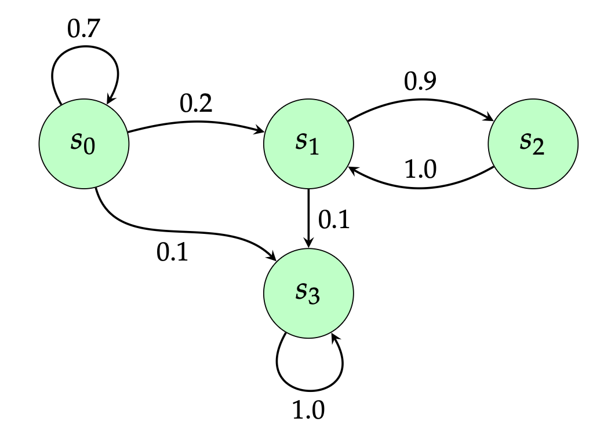

# Implementação de Cadeia de Markov

Este projeto contém um código em Python que implementa e simula uma Cadeia de Markov simples. A estrutura da cadeia, incluindo seus estados e probabilidades de transição, foi baseada em um diagrama encontrado no arquivo `Q-Learning_SistIntel2025_Handout.tex`, que serve como material de referência sobre Aprendizado por Reforço.

## Estrutura do Repositório

- `markov_chain.py`: O script principal que define e simula a Cadeia de Markov. Ele pode ser executado diretamente para observar um exemplo de "caminhada" aleatória através dos estados.
- `Q-Learning_SistIntel2025_Handout.tex`: Arquivo LaTeX que contém a descrição teórica e o diagrama da Cadeia de Markov que inspirou este código.
- `requirements.txt`: Lista de dependências do projeto. Atualmente, o projeto não necessita de bibliotecas externas.
- `.gitignore`: Arquivo para especificar arquivos e pastas a serem ignorados pelo Git.

## A Cadeia de Markov




A cadeia implementada possui 4 estados (`s0`, `s1`, `s2`, `s3`) e as seguintes probabilidades de transição, baseadas no diagrama do arquivo de referência:

- **De s0:**
  - 70% de chance de permanecer em `s0`
  - 20% de chance de ir para `s1`
  - 10% de chance de ir para `s3`
- **De s1:**
  - 90% de chance de ir para `s2`
  - 10% de chance de ir para `s3`
- **De s2:**
  - 100% de chance de ir para `s1`
- **De s3:**
  - 100% de chance de permanecer em `s3` (estado absorvente)

## Como Executar

Como o script não possui dependências externas, você pode executá-lo diretamente com um interpretador Python 3.

```bash
python3 markov_chain.py
```

Ao executar, o script irá imprimir no terminal uma simulação de 20 passos, mostrando o caminho percorrido pelos estados da cadeia a partir de um estado inicial (definido como `s0` no código).
